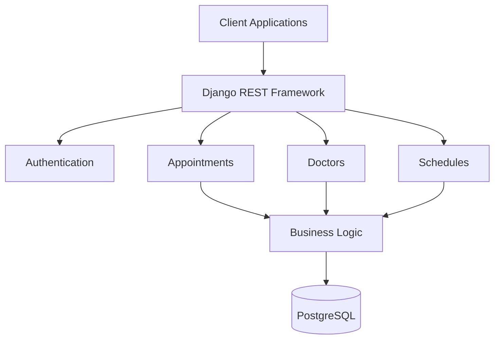

# Clinic Booking System - Savannah

A production-ready **Clinic Appointment Booking System** built with **Django REST Framework**. The system allows patients to book, cancel, and reschedule appointments with doctors in 30-minute time slots while preventing double-booking through database-level validation.

---

## Live Demo

**Application:** https://clinic-booking-1b3m.onrender.com

**GitHub Repository:** https://github.com/jacksonochieng1540/clinic_booking_savannah

---

# Tech Stack

- Django 4.2
- Django REST Framework
- PostgreSQL (Production)
- SQLite (Development)
- JWT Authentication
- Docker
- GitHub Actions
- Render

---

# Getting Started

## Clone the Repository

```bash
git clone https://github.com/jacksonochieng1540/clinic_booking_savannah.git
cd clinic_booking_savannah
```

## Create a Virtual Environment

```bash
python -m venv venv
```

### Windows

```bash
venv\Scripts\activate
```

### Linux / macOS

```bash
source venv/bin/activate
```

## Install Dependencies

```bash
pip install -r requirements.txt
```

## Apply Database Migrations

```bash
python manage.py migrate
```

## Create a Superuser

```bash
python manage.py createsuperuser
```

## Run the Development Server

```bash
python manage.py runserver
```

---

# Section 1: System Design

## Scenario

> We run a small clinic with five doctors. Patients should be able to view available appointment slots, book appointments, cancel bookings, and reschedule appointments. Each doctor works fixed 30-minute appointment slots during defined working hours. The system should prevent double-booking and be scalable for future growth.

---

## Architecture



---

## Core Models

### User

Stores authentication and user profile information.

### Doctor

Stores doctor profile information including specialty and availability.

### Patient

Stores patient profile information.

### Working Hours

Defines each doctor's available working schedule.

### Appointment

Stores patient bookings including:

- Doctor
- Patient
- Start Time
- End Time
- Status
- Cancellation Reason

---

## System Components

### Authentication

- JWT Authentication
- Registration
- Login
- Profile Management

### Doctor Management

- Doctor Profiles
- Working Hours
- Availability

### Patient Management

- Patient Profiles

### Scheduling

- Generate available 30-minute slots
- Validate working hours

### Appointment Management

- Book appointments
- Cancel appointments
- Reschedule appointments
- Prevent double booking

### Notification Service

- Welcome Emails
- Appointment Confirmation
- Cancellation Notification
- Password Reset

---

## Key Design Decisions

| Decision | Choice | Reason |
|-----------|--------|--------|
| Framework | Django REST Framework | Mature, reliable and includes ORM and Admin |
| Database | PostgreSQL | Strong consistency and ACID compliance |
| Authentication | JWT | Stateless authentication |
| Concurrency | Database locking (`select_for_update()`) | Prevents double booking |
| Time Storage | UTC | Standard timezone handling |
| Slot Generation | Dynamic | Flexible scheduling |

---

## Trade-offs

| Decision | Trade-off |
|-----------|-----------|
| Django | Slightly heavier than FastAPI but more feature complete |
| PostgreSQL | More setup than SQLite but production ready |
| Database Locking | Slightly slower but guarantees booking consistency |
| JWT | Requires token refresh but scales well |

---

# Section 2: API Implementation

## API Endpoints

| Method | Endpoint | Description |
|---------|----------|-------------|
| POST | `/appointments/api/create/` | Book Appointment |
| GET | `/schedules/api/doctors/{id}/availability/` | View Available Slots |
| PATCH | `/appointments/api/{id}/cancel/` | Cancel Appointment |
| PATCH | `/appointments/api/{id}/reschedule/` | Reschedule Appointment |
| GET | `/appointments/api/patients/{id}/appointments/` | Upcoming Appointments (Bonus) |

---

## Validation Rules

### Booking

- Appointment must be within doctor's working hours.
- Appointment must not be in the past.
- Appointment duration must be 30 minutes.
- Appointment slot must not already be booked.
- Booking must be at least one hour in advance.

### Cancellation

- Appointment must exist.
- Already cancelled appointments cannot be cancelled again.

### Rescheduling

- Appointment must exist.
- Cancelled appointments cannot be rescheduled.
- New slot must satisfy all booking validations.

---

## Error Handling

| Error | Status |
|--------|--------|
| Invalid Request | 400 Bad Request |
| Appointment Not Found | 404 Not Found |
| Slot Already Booked | 409 Conflict |
| Unauthorized | 401 Unauthorized |

---

## Example Booking Request

```http
POST /appointments/api/create/
```

```json
{
    "patient_id": 1,
    "doctor_id": 1,
    "start_time": "2026-08-10T10:00:00Z"
}
```

Example Response

```json
{
    "id": 1,
    "status": "scheduled",
    "start_time": "2026-08-10T10:00:00Z",
    "end_time": "2026-08-10T10:30:00Z"
}
```

---

## Testing

Run all tests using:

```bash
python manage.py test
```

The project contains **57 passing tests** covering the booking logic and core application functionality.

---

# Section 3: Deployment & CI/CD

## Deployment

**Live URL**

https://clinic-booking-1b3m.onrender.com

---

## CI/CD

GitHub Actions is used for Continuous Integration and Continuous Deployment.

### Continuous Integration

Runs automatically on Pull Requests.

Pipeline includes:

- Unit Tests
- Flake8
- Black
- isort
- Security Checks

### Continuous Deployment

Deployment is automatically triggered when changes are merged into the **master** branch.

The deployment pipeline:

1. Runs all tests.
2. Builds the application.
3. Applies database migrations.
4. Deploys to Render.

---

# Section 4: AI Reflection

## 1. How AI Was Used

AI assisted with:

- Designing the application architecture
- Generating serializer and view templates
- Improving validation logic
- Creating GitHub Actions workflows
- Docker configuration
- Documentation structure

---

## 2. Example Where AI Improved My Work

I asked:

> *How can I prevent double booking in Django?*

AI suggested using database transactions together with `select_for_update()`.

This approach ensures concurrent booking requests cannot reserve the same appointment slot.

---

## 3. Example Where AI Was Wrong

AI initially suggested loading all appointments into memory before checking availability.

I identified that this approach would not scale well.

Instead, I queried only the required appointments directly from the database using Django ORM filters, making the solution significantly more efficient.

---

## 4. Decisions Made Without AI

- Choosing Django REST Framework because of its maturity, built-in ORM, authentication support, and familiarity.
- Using SQLite for development and PostgreSQL for production because it provides a simple local setup while ensuring production reliability.

---

# Project Structure

```text
clinic_booking_savannah/
│
├── accounts/
├── appointments/
├── doctors/
├── patients/
├── schedules/
├── core/
├── clinic_booking/
├── Dockerfile
├── docker-compose.yml
├── requirements.txt
└── README.md
```

---

# Live Links

**Application**

https://clinic-booking-1b3m.onrender.com

**GitHub Repository**

https://github.com/jacksonochieng1540/clinic_booking_savannah

---

**Backend Developer Take-Home Assessment – Savannah Informatics**
